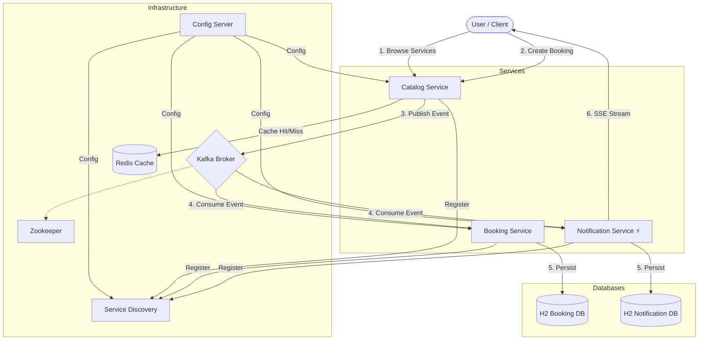

# System Architecture

## Microservices Interaction Diagram

The following diagram illustrates the architecture of the Apartment Management System, showing the interactions between microservices, infrastructure components, and external actors.

## Component Descriptions

| Component | Port | Description |
|-----------|------|-------------|
| **Config Server** | 8888 | Centralized configuration management. |
| **Service Discovery** | 8761 | Eureka server for service registration. |
| **Catalog Service** | 8081 | Manages service catalog, caches in Redis, publishes booking events. |
| **Booking Service** | 8080 | Consumes booking events, manages reservations (Blocking/JPA). |
| **Notification Service** | 8082 | Reactive service. Consumes events, streams notifications via SSE. |
| **Kafka** | 9093 | Message broker for asynchronous communication. |
| **Redis** | 6379 | In-memory cache for catalog data. |
